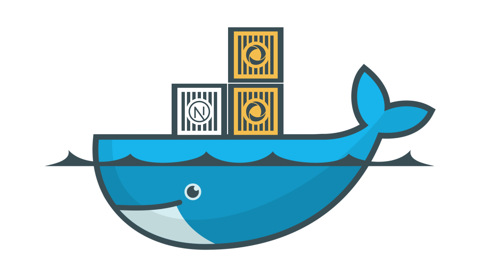

# Convex + Next.js Docker Template

This template allows you to **self-host Convex** with a **Next.js frontend** using Docker — giving you a fully offline-ready, local development environment for modern full-stack apps.

> 🚀 Perfect for rapid prototyping or development in restricted environments (e.g., no cloud/internet access).

---

## 🧠 Motivation

Convex recently announced full support for self-hosting their backend — giving developers access to the full suite of Convex's features locally, including its real-time data layer, scheduler, file storage, and the beautiful Convex Dashboard.

With that in mind, this template was created to:

* **Spin up a complete full-stack app** locally via Docker.
* **Pair any Convex-supported frontend framework** (this template uses Next.js by default).
* **Run fully offline**, no internet needed after initial setup.

---

## 📦 Stack Overview

* **Convex Backend** (Self-hosted)
* **Convex Dashboard** (UI for backend + data explorer)
* **Frontend**: Next.js 15+ (customizable)

---

## 📁 Project Structure

```txt
convex-next-dock/
├── convex/             # Convex backend source code
├── next/               # Frontend source (Next.js)
├── docker-compose.yml  # Orchestration for full stack
├── README.md           # You're reading this
```

---

## 🚀 Getting Started

### 1. Clone this repo

```bash
git clone https://github.com/yeahitsmejayyy/convex-next-dock.git
cd convex-next-dock
```

### 2. Build & Start the stack

```bash
docker-compose up --build
```

This will:

* Start the **Convex Backend** (`localhost:3210`)
* Start the **Convex Dashboard** (`localhost:6791`)
* Start the **Next.js Frontend** (`localhost:3000`)

### 3. Open your apps

* Frontend: [http://localhost:3000](http://localhost:3000)
* Dashboard: [http://localhost:6791](http://localhost:6791)

> 💡 You can view and interact with your Convex data directly through the dashboard UI.

---

## 🛠️ Customizing the Frontend

While this template ships with Next.js, you can easily swap in another frontend framework (such as React, Vite, SvelteKit, etc.) — just make sure it's compatible with Convex (see: [https://docs.convex.dev/home](https://docs.convex.dev/home)).

To do so:

* Replace the `next/` folder with your frontend code
* Update `docker-compose.yml` to point to your new frontend context and Dockerfile

---

## 🧪 Development Notes

* Convex data persists in the `data` volume
* Hot reload is supported on the frontend
* No internet required to run once containers are built

---

## 🔧 Environment Variables

You can configure ports and other variables by creating a `.env` file or modifying the inline defaults in `docker-compose.yml`.

Example:

```env
PORT=3210
SITE_PROXY_PORT=3211
DASHBOARD_PORT=6791
```

---

## ❤️ Thanks Convex!

This template wouldn’t be possible without Convex’s awesome support for self-hosting. For more, check their docs:
👉 [https://docs.convex.dev](https://docs.convex.dev)

---

## 🧼 Cleanup

To stop and remove all containers:

```bash
docker-compose down
```

To also clear volumes:

```bash
docker-compose down -v
```

---

## ✨ Author

PJ Bell – [@yeahitsmejayyy](https://github.com/yeahitsmejayyy)
